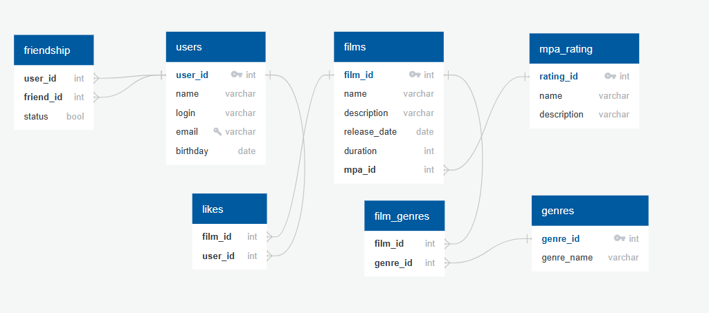

# java-filmorate
## Модель базы данных

## Описание таблиц
Таблица **users** 

*user_id* - идентификатор пользователя;

*name* - имя пользователя;

*login* - логин пользователя;

*email* - электронная почта пользователя;

*birthday* - дата рождения пользователя;

Таблица **films** 

*film_id* - идентификатор фильма ;

*name* - название фильма;

*description* - краткое описание фильма(не более 200 символов);

*release_date* - дата выхода фильма (релиз);

*duration* - продолжительность фильма;

*mpa_id* - внешний ключ, идентификатор рейтинга, отсылает к таблице mpa.

Таблица **film_genres** 

*film_id* - идентификатор фильма;

*genre_id* - идентификатор жанра, отсылает к таблице genre.

Таблица **genres** 

*genre_id* - идентиикатор жанра;

*genre_name* - название жанра.

Таблица **mpa_rating**

*rating_id* - идентификатор рейтинга;

*name* - названия рейтинга;

*description* - описание рейтинга,

Таблица **likes** 

*film_id* - идентификатор фильма, которому пользователь поставил лайк;

*user_id* - идентификатор пользователя, поставившего лайк фильму.

Таблица **friendship** 

*user_id* - идентификатор пользователя;

*friend_id* - идентификатор пользователя(обозначен другой пользователь);

*status* - дружба пользователей имеет два значения(подтверждённая - true, неподтверждённая - false):
## Основные запросы

**Получение всех пользователей**
```
SELECT * FROM users;
```
**Добавить пользователя**
```
INSERT INTO users (name, login, email, birthday)
VALUES ('name', 'login', 'email', 'birthday');
```
**Удалить пользователя по имени**
```
DELETE FROM users WHERE name = 'name';
```
**Обновить имя пользователя**
```
UPDATE users SET name = 'name1' WHERE name = 'name';
```
**Получение всех фильмов**
```
SELECT * FROM films;
```
**Добавить фильм**
```
INSERT INTO films (name, description, release_date, duration)
VALUES ('name', 'description', 'release_date', 'duration');
```
**Удалить фильм по названию**
```
DELETE FROM films WHERE name = 'name';
```
**Обновить рейтинг фильма**
```
UPDATE films SET mpa_id = 'rating_id' WHERE name = 'name';
```
